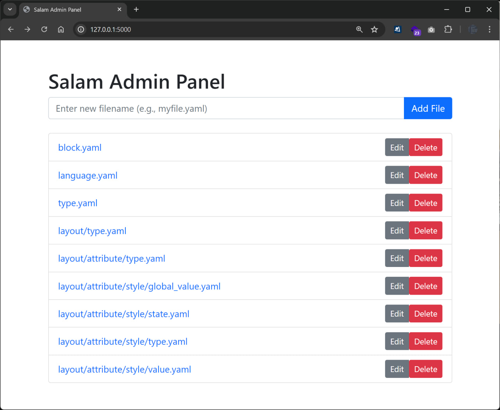

<div align="center">

<p>
    <a href="https://salamlang.ir/">
        
    </a>
</p>

# Salam Language

A new programming language empowering developers in Persian and Arabic-speaking communities.
Unlock the joy of coding—accessible, intuitive, and culturally resonant.

</div>

---

## ✨ Introduction

**Salam Language**, inspired by the word _salam_ (سلام), meaning _peace_, is the first **Persian/Arabic-based programming language**.
It is designed for simplicity, accessibility, and inclusivity—bridging the gap between developers and technology in Persian, Arabic, and related linguistic communities.

### Supported Languages

- **English**: Fully supported and ready for use.
- **Persian (فارسی)**: Fully supported and ready for use.
- **Arabic (العربية)**: Currently under development. We need contributions from native Arabic speakers to complete support.

### Why Choose Salam?

- 🌍 **Localized for Persian and Arabic Speakers**: Write and read code in your native language.
- 🧑‍🎓 **Beginner-Friendly**: Salam makes programming approachable for everyone, including students and new developers.
- 💻 **Powerful Tools**: Easy to use, but with robust capabilities for all your coding needs.

### Key Features

- ✏️ Intuitive scripting and code compilation.
- 🚀 Docker support for seamless development.
- 🔧 Linting and code checks for best practices.
- 🔄 Built-in commands for versioning and updates.

## 🚀 Getting Started

To explore Salam, run the following commands:

```bash
$ ./salam
Welcome to Salam Programming Language!
Salam is the first Persian/Iranian computer scripting language.
```

### Usage Examples

#### Execute a Script

```bash
./salam <filename>
```

#### Compile and Run Code

```bash
./salam code <content> <output_dir>
```

#### Lint Scripts

```bash
./salam lint <filename> <output_dir>
```

#### Version Check

```bash
./salam version
```

#### Update Salam

```bash
./salam update
```

For a detailed guide, visit our official site: [salamlang.ir](https://salamlang.ir)

## Control Panel

```bash
cd config/admin
pip install -r requirements.txt

python app.py
or
python3 app.py
```



## 🐳 Using Salam with Docker

Run Salam in an isolated and consistent Docker environment.

### Step 1: Pull the Image

Download the Salam Docker image:

```bash
docker pull basemax/salam:latest
```

### Step 2: Run the Image

Start an interactive session:

```bash
docker run --rm -it basemax/salam
```

#### Build Locally (Optional)

1. Clone the Salam repository:

   ```bash
   git clone https://github.com/SalamLang/Salam
   cd Salam
   ```

2. Build the Docker image:

   ```bash
   docker build -f docker/Dockerfile -t salam .
   ```

3. Verify the image:

   ```bash
   docker images salam
   ```

### Running Scripts

#### Mount a Local Script

```bash
docker run --rm -it -v $(pwd):/scripts salam ./salam /scripts/your_script.salam
```

#### Inline Code Execution

```bash
docker run --rm -it salam ./salam code "لایه: محتوا = «سلام دنیا از سلام» تمام"
```

### Explore Salam Commands

- **Check Version**:

  ```bash
  docker run --rm -it salam ./salam version
  ```

- **Update Salam**:

  ```bash
  docker run --rm -it salam ./salam update
  ```

- **Lint Scripts**:

  Lint a File:

  ```bash
  docker run --rm -it -v $(pwd):/scripts salam ./salam lint /scripts/your_script.salam /output
  ```

  Lint Inline Code:

  ```bash
  docker run --rm -it salam ./salam lint code "some salam code"
  ```

## 🤝 Contributing

We welcome contributions from the community!

- 📖 Read our [Contributing Guide](CONTRIBUTING.md).
- 🌟 Follow our [Code of Conduct](CODE_OF_CONDUCT.md).

Together, let’s make coding accessible to all.
For inquiries or feedback, visit: [salamlang.ir](https://salamlang.ir)

© 2024-2025 Salam Language Team
